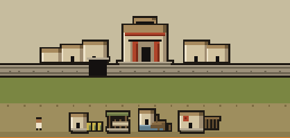
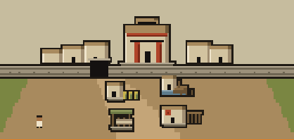
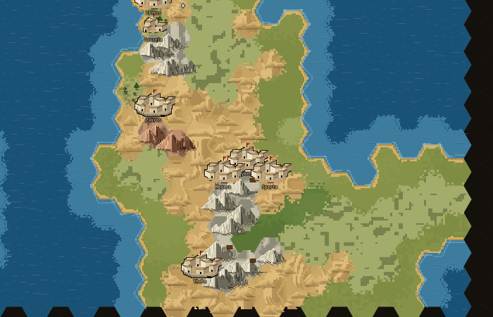

# Stadsändringarna — genomförande 2026-10-06

Timothy har instruerat Codex att arbeta själv efter rekommendationerna, committa och deploya. Detta ersätter den tidigare begränsningen till inventering samt rollen där Claude ensam integrerar. Produktionsändringarna är committade som `7213acde` (stadsvyn) och `19ce2f59` (kartstäder). Båda är lokalt verifierade och prövade mot en riktig isolerad spelserver. Grafiken är integrerad och deployad med `001a4e41`. Publik adress och origin levererar exakt de verifierade JS-filerna. Worktree: `/tmp/megaron-codex-grafik-20261005`, gren `codex/grafik-inventering`. Det tidigare sandboxhindret för Git är hävt av Timothy.

## Två avgränsade bildändringar

**Stadsvyn, `render/city.js`:** den breda gröna mellanremsan och separata gatubanden ersätts av en sammanhängande jordgård som öppnar från porten. Verksamheter fördelas i två djupplan från tre byggnader; små förskjutningar bryter katalograden. När byggnaderna ryms hålls en öppen mitt mellan grupperna; tätare städer använder den kompakta layouten. Byggnaderna har samma typer, nivåer och byggfaser som tidigare. Förhallens puts ljusas och dörröppningen minskas. Kommentarer korrigeras: scenen har en lokal, rikare befolkningsskala än kartans två serverled. Ingen tröskel eller mekanik ändras.

**Kartstäderna, `render/citysprites.js`:** den stora stadens tre främre hus placeras om; mittvolymen blir något smalare och vänds åt andra hållet. Portens öppning får en synlig gård. Sju hus och samma 62-pixlars gård, ringmur, tornen och två storleksled behålls. Den lilla stadens form ändras inte. Kustbank, grannskapsregler, etiketter och stadsdata ändras inte.

## Prov

- Alla **360** JS-tester: gröna, inga skips. `implementation/js-tests.log`.
- `git diff --check`, JS-syntax och Python-kompilering: gröna.
- Riktig renderer och drawer-kod i isolerad offline-rigg: inga browserfel.
- Fem frysta scener vid native canvasstorlek: nygrundad, liten, utrustad, nivå-3-byggnader och faktiskt tidsberäknad byggfas. Inga skillnader mellan två identiska körningar.
- Kart-/drawerbilder: två identiska körningar, determinism grön.
- Pixeldiff: alla kartskillnader inom stadsmassornas beräknade bildgränser; arbetsgriden och dess valda detaljpanel helt pixelidentiska. `implementation/containment.json`.

Reproducerbara verktyg: `tools/city_graphics_capture.py OUT [HOST]`, `tools/city_scene_cases.py OUT [HOST] [BEFORE_CITY_JS]`, mot befintliga showcase-sidor serverade från worktreens `web/`. Före/efter använder samma fixtur. Den raserade Amyklai-flaggan i inventeringens fixtur är korrigerad till `active` i båda provets armar; grundgeografin kontrolleras för giltig kust, farmplacering och land/sjöenheter. Full geografiskt korrekt kustfond är inte implementerad, eftersom scene-input saknar riktningen.

## Bevisgränser och kvarvarande steg

Offlinebilderna är renderer-/layoutprov med explicita fixtursvar. Därutöver har en riktig isolerad spelserver byggts och körts mot färsk PostgreSQL 16 och egen Redis, utan Agora-konfiguration. `/healthz` rapporterade `19ce2f59`, migration 158. En faktisk registrering, anslutning och stadsgrundning följdes av riktig `/play` och City-drawer på desktop 1280×900 och mobil 390×844, utan API-mockning eller browserfel. Båda levererade JS-filerna är byte-identiska med arbetsgrenen. Se `implementation/acceptance-proof.json` och desktop-/mobilbilderna. Detta är stadsytans tekniska smoke-prov, inte ersättning för Timothys mänskliga första-sessionen-test. Native scenbilder har heltalsraster; befintlig drawer-CSS förstorar till fraktionell bredd som tidigare. Nygrundad scen får inga påhittade verksamheter. Den täta nivå-3-fixturen har redan före ändringen byggnader som delvis kapas i ytterkanten; detta befintliga kapacitetsproblem är inte löst i gårdskompositionen.

Mutationstest är inte tillämpligt på en ren form-/layoutändring; determinism och inneslutningsdiff ger relevant bildbevis. Ingen mänsklig BILD-bedömning har ännu skett av efterbilderna. Timothy har uttryckligen begärt deploy; ingen ytterligare tillståndsfråga införs här.

## Reproduktion och referenser

Bygg från `server/`: `go build -ldflags '-X main.buildCommit=19ce2f59' -o /tmp/megaron-stader-implementation/temenos ./cmd/server` (de två produktionscommitsen; senare commits dokumenterar provet).

Den egna riggen använder container `megaron-city-20261006-pg`, image `postgres:16-alpine`, user/database `city_test`, endast lokal fixturepassword `city_local_fixture`, port `127.0.0.1:18732:5432`; Redis `megaron-city-20261006-redis`, image `redis:7-alpine`, port `127.0.0.1:18579:6379`. Inga befintliga containrar används eller muteras.

Kör: `python3 tools/city_graphics_acceptance.py /tmp/megaron-stader-implementation 19ce2f59`. Skriptet startar och avslutar sin egen spelprocess på port 18397; rapporten innehåller inga autentiseringsuppgifter. Produktionsasset-hash finns i proof JSON.

På Timothys påminnelse har även `img/stadsvy.jpeg` och `img/f0382384-32ad-45b1-8195-b7f2903524ac.jpeg` granskats direkt. Deras användbara struktur är sammanhängande gårdar, portens förbindelse med bebyggelsen och överlappande volymer. Nuvarande implementation är ett mindre steg inom den befintliga renderaren, inte referensens fulla terrasserade stad. Kartreferensens sadeltak och senare tempelformer förs inte över till akhaisk bronsålder.

Nästa möjliga bildslice är starkare djup/terrassering i stadsvyn, efter Timothys bedömning av detta steg. Befintligt kapacitetsproblem i fullt uppgraderad scen och fraktionell CSS-skalning redovisas ovan; de är inte lösta här.

## Deploy utförd

2026-10-06 07:50 — `001a4e41` pushad till master och hämtad på CT 126. `city.js` och `citysprites.js` hämtade via både originens localhost och https://megaron.formatet.se är byte-identiska med den verifierade grenen. Se `implementation/deploy-proof.json`. Ingen Go-kod eller migration ändrades; serverprocessen kör därför kvar backend `43d94a6`, `/healthz` är OK och migration 158 är ren. Ingen omstart behövdes för de statiska modulerna. Publik cache kan kräva Ctrl+Shift+R i en redan öppen spelvy.
