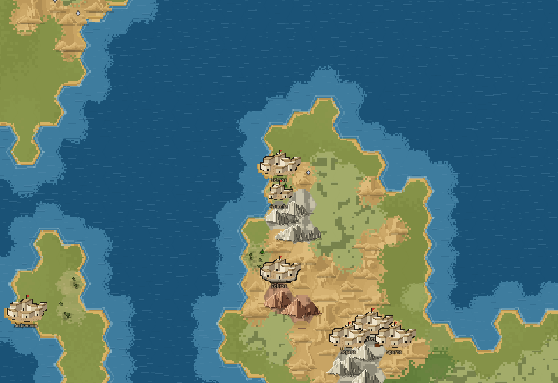
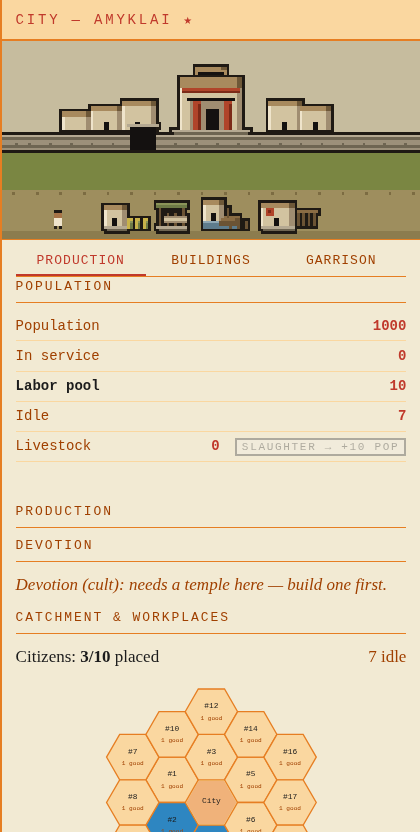
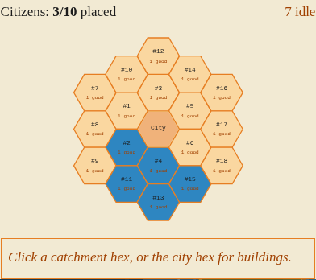

# Städerna — grafikinventering, 2026-10-06

## Sammanfattning

Timothy har prioriterat städerna: kartstäderna och stadsvyn i City-fönstret. Detta är fas 1, inventering och förslag. Ingen renderer har ändrats. Källkod: `43d94a60`, `codex/grafik-inventering`. Ingen merge, push eller deploy. Första sessionen gör Timothy själv som mänsklig testare.

**Bedömning:** behåll kartstadens akhaiska byggnadsspråk och inhägnad. Förstärk dess läsbara insida och relation till grannstäder. Stadsvyn behöver framför allt en sammanhängande platskomposition: dagens fristående byggnader och breda horisontella markband gör den till en uppställning snarare än en bebodd miljö. Den senare frågan föreslås som första bildslice, efter Timothys val.

## Kontrakt och bevisgräns

- Problem: staden ska kännas som en plats och dess form ska gå att läsa i faktisk kartkontext.
- Spelarsanning: kartan visar synlig storleksklass och mur; stadsvyn visar befintliga byggnader och faktiskt pågående byggande.
- Invariant: inga påhittade funktionella byggnader, ingen befolkningsläcka, ingen ändring av storleksklasser eller murregler.
- Scope: två stadsområden, befintliga bilder, riktad kod- och vaultläsning, denna rapport.
- Acceptans: nulägesbilder, konkreta svagheter, förslag, storlek och berörda renderare för båda områdena.
- Stopvillkor: en ny spelregel, kulturmodell eller bildregel kräver Timothy.
- Kedjegrind: underlag för visuell läsbarhet, inte bevis för genomförd spelkedja.

Bilderna togs 2026-10-05 av en isolerad offline-rigg med dåvarande produktionsmoduler. Kartans kamera: zoom 1,0; browser-DPR: 1. PNG-filerna är oförstorade skärmutsnitt. Se `capture-metadata.json`. Öppna dem vid 100 %; automatisk bildanpassning kan ändra upplevd storlek. Kartcanvasen sattes till 2400×1800 och CSS-ytan till 1200×900; ange därför inte att en logisk konstpixel automatiskt motsvarar två skärmpixlar i dessa bilder.

Geografin är den äldre exporterade `web/static/fixtures/world-full.json`, med vissa syntetiska objekt. Detta är varken dagens mapgen-prov eller en körande spelservers acceptans. Stadslådan använder riktig `ui/drawers/city.js`, men dess API-svar är lokala fixturer. Inga runtime-health-, migrations- eller E2E-påståenden görs.

**Fixturfynd:** Amyklai har `state: razed` även i `fixture-additions.json`, samtidigt som stadslådan får befolkning 1000 och fungerande byggnader. Bilden belägger scenens komposition och verkliga CSS-storlek, men inte samma stads tillstånd på karta och i låda. Basbilden ska ersättas med en konsekvent aktiv stad före en implementeringsslice. De separata kartbilderna nedan används för aktiv bebyggelse; Amyklai används inte som exempel på kartstadens normala storlek.

## Profilen som styr förslagen

Vault: `megaron_minoisk_visuell_riktning`, `temenos_designprinciper`, `megaron_terrangrendering` §Bebyggelse, `megaron_stader_omgang2_20260727`, samt stadsvydelen av `megaron_stader_20260727`.

Varm, bebodd minoisk arbetsplats med puts, textil, terrakotta och jord; svalare maritim kartvärld. Djärva accenter med tydliga uppgifter, sparsamt ornament, silhuett och läsbarhet före smådetaljer. Illustrationerna är pixelgrafik med hårda former och charcoal-kontur på byggda solida former; marken ska lösas in i landskapet och får ingen klistermärkesram. Gemensam ljusriktning och materialpalett förenar karta och stadsinzoomning.

Kartans nuvarande arkitektur är avsiktligt akhaisk, 1400–1300 f.Kr.: platta jordtak och kubiska putsade hus, inte senare takpannor eller sadeltak. Två storleksled gäller; palatssalen är medvetet borttagen från kartan och bärs av stadsvyn. Förslagen återinför inte gamla fyra kartled eller en dominant palatsbyggnad på kartan.

## 1. Kartstäderna

### Det som fungerar

Ljus puts mot jordtak ger tydliga byggda volymer. Ringmur och gårdsmark ger staden en insida. Det är rätt rot enligt tidigare omgång: staden är ett område att gå in i, inte en husikon. Kustbankens befintliga teknik hör till markförankringen och ska bevaras. De små och stora stadsmassorna är märkbara utan att exakt population visas.

### Svagheter i bilderna

1. **Närliggande städer bildar en enda ljus bebyggelsekedja.** I klungan kring Megara/Sparta är det svårt att skilja varje stads rum och etikett. Större sprites skulle förstärka problemet; detta är ett grannskaps- och kompositionsproblem, inte brist på husdetaljer. Bilden belägger trängsel i denna äldre geografi, inte att dagens grundningsregler kan återskapa den.
2. **Husmassan tar mycket av den synliga insidan.** I de större formerna dominerar tak, väggar och mörka fogar. Gård och port kan läsas, men den öppna förbindelsen genom staden blir svag. En ny detaljrik husfamilj skulle lätt öka bruset.
3. **Likartad form och orientering ger upprepade stämplar.** Stora städer liknar varandra även när omgivningen skiftar från kust till kullar. Akhaiskt formspråk är avsiktligt; frågan gäller variation inom samma formfamilj, inte nya kultursystem.
4. **Stenen konkurrerar med bebyggelsen.** På kalkstens- och kullbakgrund ligger mycket ljus form tätt kring husen. Stadens jordyta, port och sammanhållna skugga blir därför viktigare än ytterligare ljusa takdetaljer.

### Förslag

Gör en avgränsad kompositionsrunda inom dagens två kartled. Reservera en tydligare gårdsöppning och entré genom att placera om eller minska någon husvolym, och låt murens främre kant förbli obruten nog att läsas. Pröva detta vid samma yttermått före någon förstoring. Därefter kan ett fåtal deterministiska kvartersvarianter prövas med bibehållen mur- och storlekssignal. Variationen får inte antyda uppgraderingar eller byggnader som servern inte skickar.

Grannstädernas etiketter ska bedömas tillsammans med siluetterna. En eventuell etikettlösning är en separat slice om spritekompositionen ensam inte räcker. Ändra inga grundningsregler för att få bilden att passa.

**Storlek:** medel för komposition inom två led; större om variation, etikettplacering och terränganpassning blandas. Börja med kompositionen.

**Berörda filer:** `web/static/js/megaron/render/citysprites.js:122` (gård/mur/hus och djupordning), `citysprites.js:294` (två former), `render/pixelgrid.js:11` (delad palett, ändra bara vid belagt tonproblem), `render/map.js:2858` (kustbank) och `map.js:2951` (storlek, massa och statusankare). Verktyg: befintliga `tools/citysheet.mjs` och `tools/shot.py cities`. Ingen serverändring föreslås.

**Nästa bildprov:** samma kartutsnitt före/efter, båda led och mur 0–3 på slätt, kalksten, olivlund och kust. Tät stadsgrupp och etiketter med. Frys animation, kontrollera determinism och att pixeldiffen ryms i stadspositionerna. Timothy bedömer vid faktisk storlek; kontaktark räcker inte.

## 2. Stadsvyn och stadens arbetsyta

### Det som fungerar

Megarons putsade fasad och jordfärger hör till samma materialvärld som kartan. Byggnaderna har skilda funktionella siluetter: marknadens soltak, hamnens bassäng och kasernens spjutställ kan börja läsas som olika verksamheter. Befintlig kod visar byggfaser och tillbyggnader; det fysiska byggandet är en grund att behålla. Arbetsrutnätet är en separat beslutsyta och ska fortsätta bära exakta placeringar.

### Svagheter i bilden och koden

1. **Staden är en rad motiv snarare än en sammanhängande miljö.** Citadell, mur, grönt markband och byggnadsrad staplas horisontellt. Den stora tomma remsan mellan muren och arbetsbyggnaderna ger inget tydligt rumsligt samband. Även en relativt utrustad fixtur får mycket obebodd yta. Detta sammanfaller med vaultens tidigare fynd om tre tomma band i en nygrundad stad.
2. **Byggnaderna läses som en katalograd.** De står på samma raka baslinje med fristående mörka konturer. Det ger snabb sortering men svag platskänsla. En stads gård, passage och byggda kropp behöver hållas ihop utan att de funktionella siluetterna försvinner.
3. **Megarons mörka öppning drar blicken mer än verksamheterna.** Den centrala symmetrin och mörka porten gör fonden dominant. Förslaget är inte att ta bort salen: låt putsad förhall, pelare och smalare port bära formen. Samma brist står redan i `megaron_stader_20260727` §Vad som INTE är bra nog i stadsvyn.
4. **Kusten finns bara som en liten hamnsymbol.** Amyklai-fixturen är kustnära, men fondens gröna remsa gör scenen lika inlandsbetonad som en slättstad. `startCityAnim` får centrumhexens terräng, inte grannskapets kustriktning. Hamnens lokala bassäng är dock en avsiktlig byggnadssymbol enligt vaulten; den är inte ensam bevis för en felplacerad hamn. En faktisk kustfond kräver uttrycklig, korrekt geografidata.
5. **Skalningen försvagar pixlarnas jämnhet.** Scenen är 160×76 logiska pixlar, canvas 320×152 och CSS-box i bilden cirka 418×198,55. `image-rendering: pixelated` gör den skarp, men skärmpixelbredderna blir ojämna vid denna fraktionella förstoring. En oförstorad PNG är därför inte samma sak som ett jämnt heltalsraster. Detta är ett separat, litet layoutproblem.
6. **Arbetsgriden visar en abstrakt yta.** Hexnummer och antal varor dominerar, medan terrängens karaktär inte går att läsa särskilt väl utan val och detaljpanel. Den fyller ett annat syfte än stadsillustrationen; försök inte få själva staden att växa in i de 19 arbetshexarna. En senare läsbarhetsrunda kan pröva diskreta terrängtecken med samma exakta plats-ID och arbetarsanning.

### Förslag: börja med platsen

Behåll den dataförankrade scenen, men komponera den som **en gård med anknutna verksamheter och citadellet bakom**. En sammanhängande yta av slagen jord ska föra blicken mellan port, öppen gård och arbetsbyggnader. Lägg byggnader i två förskjutna djupplan med tydlig sikt till deras kännetecken. Den tomma ytan ska vara en avsiktlig gård eller passage, inte ett obrutet grönt band. Byggnadens storlek och nivå ska fortfarande komma från verklig data, och pågående bygge ska behålla en synlig plats nära betraktaren.

Låt variationen komma från proportioner, placering och sparsam puts/terrakotta/textil, inte fler färgprickar eller generella friser. Megaron ger fonden värdighet; arbetsbyggnader och fysisk konstruktion ger liv. Gångaren ska kalibreras mot övriga aktörsformer innan fler animerade figurer läggs till. Inga dekorhus får misstas för funktionella byggnader.

Första omgången bör pröva samma verkliga byggnadsuppsättning i nuvarande och föreslagen komposition. Nygrundad tom stad och fullt utrustad stad är två acceptansfall. En kustfond är nästa steg, eftersom dagens scene-input saknar riktningen. Rita inte ett godtyckligt hav bakom alla städer med hamn.

**Storlek:** medel för sammanhängande gårdskomposition och förhall. Liten för separat heltalsvisning av canvasen. Medel för geografiskt korrekt kustfond med ny konsumerad indata. Blanda inte alla tre i första implementationen.

**Berörda filer:** `render/city.js:32` (scen och djupplan), `city.js:103` (markband och ritordning), `city.js:156` (citadell och lokal befolkningsmodell), `city.js:264` (verksamheter) och `city.js:303` (layout). Byggnadsformer: `render/citybuildings.js`; gemensamma stämplar/palett: `render/pixelgrid.js`. Koppling till riktiga data: `ui/drawers/city.js:243`. CSS-storlek: `web/static/megaron.css:1666`. Catchment-arbetsytan ligger separat i `ui/citygrid.js` och ingår inte i den första kompositionsslicen.

**Kodfynd att verifiera före ny bildslice:** kartan har två `size_tier`-led med servertröskel 800; stadsvyn beräknar fyra lokala befolkningsnivåer vid 1000/5000/15000. Kommentarerna påstår att samma led används. Det kan vara rimligt med rikare lokal vy, men kommentaren är inte sann och relationen behöver beskrivas uttryckligt. Denna inventering ändrar varken trösklar eller modell och kallar inte skillnaden ensam en spelbugg.

**Nästa bildprov:** konsekvent aktiv stad, verklig byggnadsdata, nygrundad/utrustad och byggande pågår. Visa samma stad på karta och i låda, vid desktop och smal viewport. Granska förhall, byggnaders fötter, gångarens skala och eventuell överlappning. Frys animation och ta två identiska körningar före pixeldiff. En statisk bild bevisar inte att worker-loop eller bygganimation fungerar.

## Föreslagen arbetsordning

1. Stadsvyn: en sammanhängande gård och färre tomma band, med samma byggnader och datainput. Bedöm före/efter vid faktisk storlek.
2. Kartstaden: stärk gård, port och mur inom dagens yttermått; kontrollera grannskapet innan deterministiska varianter övervägs.
3. Separata läsbarhetsfrågor: heltalsskalning, korrekt kustinput och stadsgruppens etiketter, bara där bilderna visar behovet.

Detta är ett förslag till Timothy, inte ett beslutat kanonbyte eller godkännande av någon fas 2.

## Grindar och leverans

| Grind | Utfall |
|---|---|
| Kod | Endast rapport och kopierade basbilder; inga produktionsändringar. Build, mutationstest och rendertidsregression är inte tillämpliga. |
| Visuell | Befintliga skärmutsnitt granskade vid native storlek, mot normativa bildregler. Inget före/efter eller mänskligt BILD-godkännande. |
| Semantisk | Fixturens raserade/aktiva Amyklai identifierad och avgränsad. Två kartled kontra fyra lokala scennivåer noterat som verifieringspunkt. |
| Användare | Inget nytt spelarflöde provat. Riktig drawer-kod med fixtursvar är layoutunderlag, inte användaracceptans. |
| Drift | Ingen driftändring. |

Övriga tre grafikområden är parkerade enligt Timothys stadsfokus. Inga nya riggar eller mockbilder skapades. En senare implementeringsslice behöver en konsekvent aktiv basstad och Timothys bedömning av konkreta före/efter-bilder.
